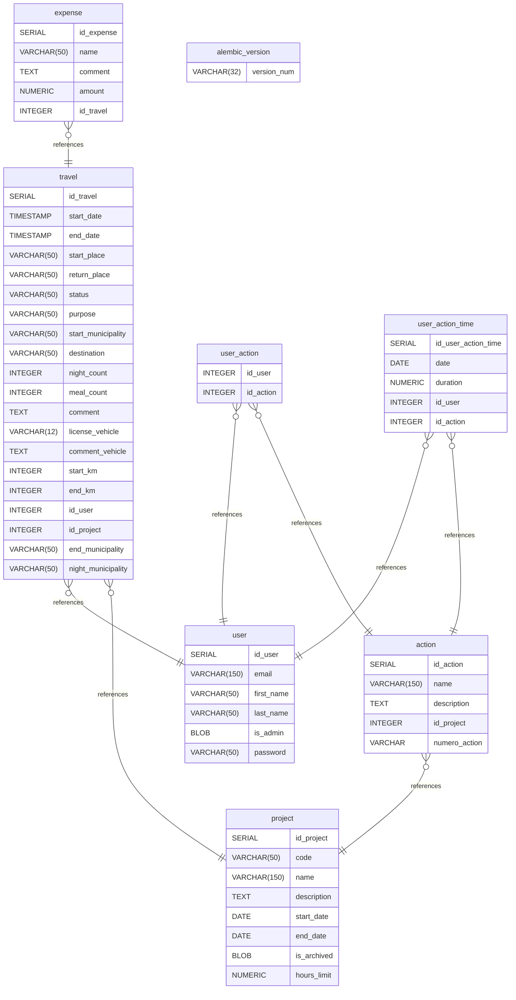

# GTT database diagram documentation

## Summary

- [Introduction](#introduction)
- [Database Type](#database-type)
- [Table Structure](#table-structure)
  - [alembic_version](#alembic_version)
  - [project](#project)
  - [user](#user)
  - [action](#action)
  - [travel](#travel)
  - [user_action](#user_action)
  - [user_action_time](#user_action_time)
  - [expense](#expense)
- [Relationships](#relationships)
- [Database Diagram](#database-diagram)

## Introduction

## Database type

- **Database system:** PostgreSQL

## Table structure

### alembic_version

| Name            | Type        | Settings        | References | Note |
| --------------- | ----------- | --------------- | ---------- | ---- |
| **version_num** | VARCHAR(32) | 🔑 PK, not null |            |      |

### project

| Name            | Type         | Settings        | References | Note |
| --------------- | ------------ | --------------- | ---------- | ---- |
| **id_project**  | SERIAL       | 🔑 PK, not null |            |      |
| **code**        | VARCHAR(50)  | not null        |            |      |
| **name**        | VARCHAR(150) | not null        |            |      |
| **description** | TEXT         | not null        |            |      |
| **start_date**  | DATE         | not null        |            |      |
| **end_date**    | DATE         | not null        |            |      |
| **is_archived** | BLOB         | not null        |            |      |
| **hours_limit** | NUMERIC      | not null        |            |      |

### user

| Name           | Type         | Settings        | References | Note |
| -------------- | ------------ | --------------- | ---------- | ---- |
| **id_user**    | SERIAL       | 🔑 PK, not null |            |      |
| **email**      | VARCHAR(150) | not null        |            |      |
| **first_name** | VARCHAR(50)  | not null        |            |      |
| **last_name**  | VARCHAR(50)  | not null        |            |      |
| **is_admin**   | BLOB         | not null        |            |      |
| **password**   | VARCHAR(50)  | not null        |            |      |

#### Unique constraints

| Name           | Fields |
| -------------- | ------ |
| user_email_key | email  |

### action

| Name              | Type         | Settings             | References                   | Note |
| ----------------- | ------------ | -------------------- | ---------------------------- | ---- |
| **id_action**     | SERIAL       | 🔑 PK, not null      |                              |      |
| **name**          | VARCHAR(150) | not null             |                              |      |
| **description**   | TEXT         | not null             |                              |      |
| **id_project**    | INTEGER      | not null             | fk_action_id_project_project |      |
| **numero_action** | VARCHAR      | not null, default: 1 |                              |      |

### travel

| Name                   | Type        | Settings                    | References                   | Note |
| ---------------------- | ----------- | --------------------------- | ---------------------------- | ---- |
| **id_travel**          | SERIAL      | 🔑 PK, not null             |                              |      |
| **start_date**         | TIMESTAMP   | not null                    |                              |      |
| **end_date**           | TIMESTAMP   | not null                    |                              |      |
| **start_place**        | VARCHAR(50) | not null                    |                              |      |
| **return_place**       | VARCHAR(50) | not null                    |                              |      |
| **status**             | VARCHAR(50) | not null                    |                              |      |
| **purpose**            | VARCHAR(50) | not null                    |                              |      |
| **start_municipality** | VARCHAR(50) | not null                    |                              |      |
| **destination**        | VARCHAR(50) | not null                    |                              |      |
| **night_count**        | INTEGER     | not null                    |                              |      |
| **meal_count**         | INTEGER     | not null                    |                              |      |
| **comment**            | TEXT        | not null                    |                              |      |
| **license_vehicle**    | VARCHAR(12) | not null                    |                              |      |
| **comment_vehicle**    | TEXT        | not null                    |                              |      |
| **start_km**           | INTEGER     | not null                    |                              |      |
| **end_km**             | INTEGER     | not null                    |                              |      |
| **id_user**            | INTEGER     | not null                    | fk_travel_id_user_user       |      |
| **id_project**         | INTEGER     | not null                    | fk_travel_id_project_project |      |
| **end_municipality**   | VARCHAR(50) | not null, default: RA       |                              |      |
| **night_municipality** | VARCHAR(50) | not null, default: sisteron |                              |      |

### user_action

| Name          | Type    | Settings        | References                      | Note |
| ------------- | ------- | --------------- | ------------------------------- | ---- |
| **id_user**   | INTEGER | 🔑 PK, not null | fk_user_action_id_user_user     |      |
| **id_action** | INTEGER | 🔑 PK, not null | fk_user_action_id_action_action |      |

### user_action_time

| Name                    | Type    | Settings        | References                           | Note |
| ----------------------- | ------- | --------------- | ------------------------------------ | ---- |
| **id_user_action_time** | SERIAL  | 🔑 PK, not null |                                      |      |
| **date**                | DATE    | not null        |                                      |      |
| **duration**            | NUMERIC | not null        |                                      |      |
| **id_user**             | INTEGER | not null        | fk_user_action_time_id_user_user     |      |
| **id_action**           | INTEGER | not null        | fk_user_action_time_id_action_action |      |

### expense

| Name           | Type        | Settings        | References                  | Note |
| -------------- | ----------- | --------------- | --------------------------- | ---- |
| **id_expense** | SERIAL      | 🔑 PK, not null |                             |      |
| **name**       | VARCHAR(50) | not null        |                             |      |
| **comment**    | TEXT        | not null        |                             |      |
| **amount**     | NUMERIC     | not null        |                             |      |
| **id_travel**  | INTEGER     | not null        | fk_expense_id_travel_travel |      |

## Relationships

- **action to project**: many_to_one
- **travel to project**: many_to_one
- **travel to user**: many_to_one
- **user_action to action**: many_to_one
- **user_action to user**: many_to_one
- **user_action_time to action**: many_to_one
- **user_action_time to user**: many_to_one
- **expense to travel**: many_to_one

## Database Diagram

[]
